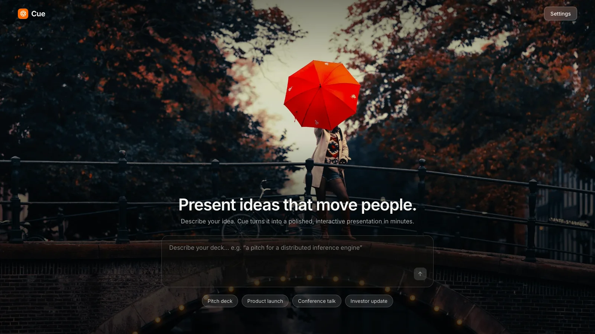
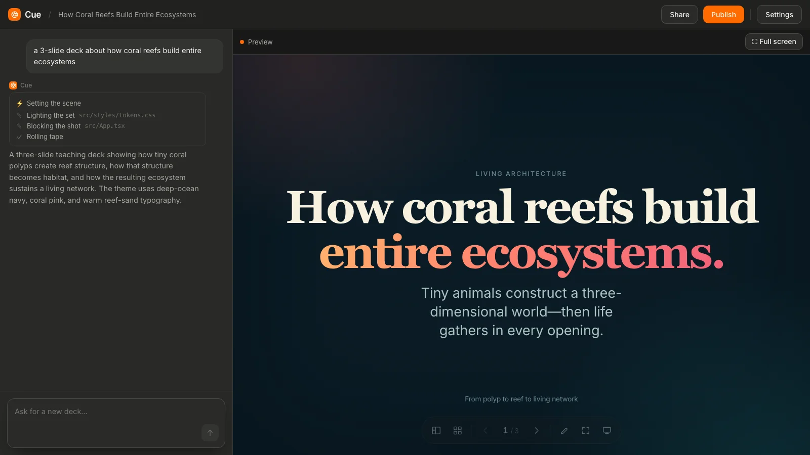

<div align="center">


# Cue

**Turn a single prompt into a presentation that's actually a working web app.**

Every slide is real HTML/CSS/JS — not an image, not a PDF. Animations, live charts,
interactive components, whatever you can describe. Free, open source, no account needed.

[Quick start](#quick-start-2-minutes) · [How it works](#how-it-works) · [Contributing](#contributing)

</div>

<br>



<br>

## What is this?

You type what you want — *"a pitch deck for a startup building an AI copilot for
accountants"* — and Cue generates a complete, multi-slide deck: cover slide, content
slides, a closing slide, all in a consistent theme it designs on the fly. You can watch
it think, and you can talk to it afterward to change anything ("make slide 3 punchier,"
"swap the color theme to green").



Under the hood, every deck is a small React app (`App.tsx` + `tokens.css`) rendered by a
fixed, hand-built slide engine — so it's reliable (the model can't break the layout
system, only fill it in) and it's a *real webpage* the whole way through, not a
generated screenshot.

## Quick start (2 minutes)

You'll need **Docker** running, **Go 1.22+**, and **Node 20+**.

```bash
git clone https://github.com/sasdeployer/cue-ai.git
cd cue-ai
./dev.sh
```

That's it — `dev.sh` starts Postgres, the API server, and the web app, and opens
everything up on **http://localhost:5273**. You don't need an API key to try it: with no
key configured, Cue runs in **canned mode** and hands back a real sample deck so you can
see the whole flow working end to end.

Want it to actually generate decks with AI? Copy `.env.example` to `.env` and drop in a key:

```bash
cp .env.example .env
# then edit .env and set OPENAI_API_KEY=sk-... (or ANTHROPIC_API_KEY=sk-ant-...)
```

Restart the server (`cd server && go run .`) and you're generating real decks.

> **New to this codebase?** `CLAUDE.md` has the full architecture tour, every design
> decision explained, and the gotchas that'll save you time (like: the server doesn't
> hot-reload, so you'll need to restart it after backend changes). Read it before you
> go spelunking — it'll answer most of your "wait, why does this work this way?"
> questions.

## How it works

```
you type a prompt
      │
      ▼
Go server calls an LLM (OpenAI/Anthropic) with a tool-using agent loop
      │  → the model can research the web (a fetch_url tool) before writing
      ▼
model writes exactly two files: App.tsx (the slides) + tokens.css (the theme)
      │
      ▼
server compile-checks the output against the fixed slide engine — retries
silently if it's broken, so you only ever see a working deck
      │
      ▼
deck streams to your browser, live, step by step — you watch it get built
```

The whole reason this is reliable is that the model's job is small and constrained: it
never touches the engine, the components, or the layout system — just the content and
theme. That's what makes "one prompt → a working app" actually work instead of being a
demo that breaks the moment you ask for something slightly unusual.

## Bring your own key (BYOK)

Cue runs with a shared default key so anyone can try it for free. If you'd rather use
your own OpenAI or Anthropic account, open **Settings** in the app and paste your key in
— it's encrypted in your own browser (never sent to us to store), and used only for your
own generations. No signup, no account, nothing to remember.

## Project layout

```
web/                  the React app (landing page, builder, gallery)
  src/deck-runtime/      renders generated decks live, safely, in the browser
  src/deck-template/     the fixed slide engine + component library
server/               the Go API
  agent.go               the tool-using LLM agent loop
  compile.go              checks a deck compiles before you ever see it
db/init.sql           database schema (Postgres + pgvector)
docs/                 design notes from past features
```

## Contributing

Issues and PRs are welcome — this is a young project and there's plenty to build
(see `CLAUDE.md`'s "Deferred" section for what's intentionally not done yet, like a
proper logo mark). Before diving into the code:

1. Read **`CLAUDE.md`** — it's kept up to date with the real architecture and will save
   you from re-discovering things the hard way.
2. Run `./dev.sh` and generate a few decks so you have a feel for the product.
3. `cd web && npx tsc -p tsconfig.app.json --noEmit` and `cd server && go build ./...`
   before opening a PR — both are fast and catch real breakage.

## License

MIT — see `LICENSE`. Cue's slide engine started as a fork of
[bolt-slides](https://github.com/stackblitz/bolt-slides) by StackBlitz (also MIT, see
`NOTICE.md`); the rest of the product — the AI generation pipeline, the live in-browser
runtime, the step-by-step build feed, BYOK, everything else — is original work.
