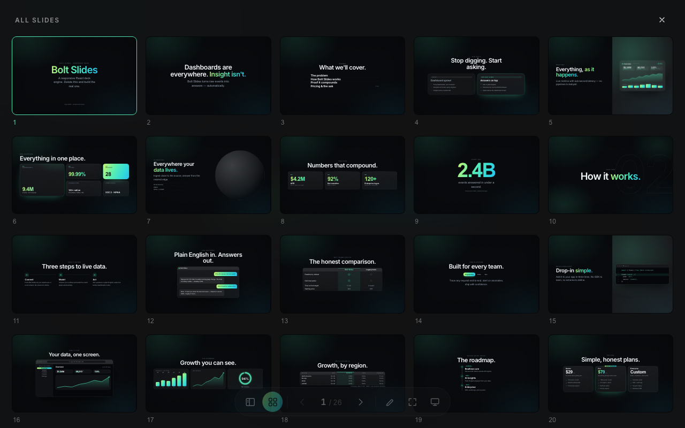

<div align="center">

# ⚡ Bolt Slides

**Presentation decks that are working web apps.**

One prompt in — your agent builds a deck where every slide is a live, responsive web page.
3D, live data, working prototypes, and whatever you can prompt.

[](https://bolt.new/github.com/stackblitz/bolt-slides)
[](https://stackblitz.com/github/stackblitz/bolt-slides)
[](./LICENSE)


</div>

---

## Why we made this

AI for slides is awesome, but the outputs tend to be slop: generic layouts, walls of bullets, nothing you'd be proud to present.

And also: why are slides still *static*? Agents can build *anything*. What would it look like if you (tastefully) turned them loose on slides?

Bolt Slides is what we built to find out: building blocks any agent (Claude Code, Codex, Cursor, Bolt) can compose stunning, compelling presentations with. Bespoke layouts, real typography, considered animations, interactive anything. Every deck is a real web app, responsive on any screen, shared as a link.

**Taste comes standard.**

[See what that looks like →](https://x.com/boltdotnew/status/2077770386444341332?s=20)

Under the hood it's a classic paged deck — Slidev-style dock, thumbnail sidebar, grid overview, click-builds, annotations, synced presenter mode — where each slide is a plain React component. If you can build it for the web, you can present it.

## Quick start

**With an agent (the fun way).** Open the repo in [Bolt](https://bolt.new/github.com/stackblitz/bolt-slides) and prompt it:

> Build me a deck pitching «your thing» to «your audience».

The bundled skill ([`.bolt/skills/slides/SKILL.md`](./.bolt/skills/slides/SKILL.md)) teaches the agent how to theme, compose, and write the deck — including setting the tab title and favicon — so a single prompt returns a finished, presentable app.

**By hand.**

```bash
git clone https://github.com/stackblitz/bolt-slides
cd bolt-slides
npm install
npm run dev
```

The dev server opens a 26-slide demo that exercises every component. Delete the demo slides in [`src/App.tsx`](./src/App.tsx) and author your own.

## Authoring

Each top-level child of `<Deck>` is one slide. Compose them from the component library, or write plain JSX:

```tsx
<Deck>
  <Cover
    kicker="Acme · Series A"
    title={<span className="accent-text">Acme</span>}
    subtitle="Answers, not dashboards."
    notes="Welcome — set up the problem, then hold a beat."
  />

  <Slide center nav="Thesis">
    <h2 className="headline">
      Dashboards are everywhere. <span className="accent-text">Insight isn't.</span>
    </h2>
    <Build at={1}>
      <p className="subhead">Acme turns raw events into answers — automatically.</p>
    </Build>
  </Slide>

  <Agenda
    kicker="Agenda"
    title="What we'll cover."
    items={['The problem', 'How it works', { title: 'Pricing & the ask', hint: '5 min' }]}
  />
</Deck>
```

- **`<Build at={n}>`** reveals content on the nth click — arrow keys step through builds before advancing slides, forward *and* back.
- **`notes="…"`** on any slide shows up in presenter mode; notes you edit while presenting persist locally.
- Slides are ordinary React — fetch live data, mount a 3D scene, embed your actual product.

## Presenting



| Key | Action |
| --- | --- |
| `→` `↓` `Space` | Next (reveals builds first) |
| `←` `↑` | Previous (rewinds builds) |
| `Home` / `End` | First / last slide |
| `S` | Sidebar — thumbnail rail |
| `G` | Grid view — every slide at once |
| `A` | Annotate — pen, highlighter, shapes, eraser |
| `F` | Fullscreen |
| `P` | Presenter mode — synced new tab |
| `H` | Hide the UI |
| `Esc` | Close overlays |

- **Presenter mode** opens in a second tab with a timer, next-slide preview, and editable notes — kept in sync with the audience tab via `BroadcastChannel`.
- **Annotations are content-anchored**: a circle drawn around a stat on a laptop rings the same stat on a phone, wherever the layout moved it. Drawings persist per slide.
- **Deep links**: the URL hash tracks the slide (`/#7`), so you can share a link straight to a slide.

## Component library

| | Components |
| --- | --- |
| **Structure** | `Cover` `Agenda` `Section` `Split` `Bento` `Slide` |
| **Data** | `Charts` (bar · line · donut) `Table` `StatGrid` `BigNumber` `CountUp` `VisualDashboard` |
| **Story** | `Quote` `Contrast` `Comparison` `Timeline` `Steps` `Chat` |
| **Product** | `CodeWindow` `BrowserFrame` `Pricing` `Team` |
| **Flair** | `Globe` `TiltCard` `SpotlightCard` `Marquee` `Accordion` `Tabs` |

All of them are demoed in the bundled starter deck, and all of them are responsive.

## Theming

Every color, font, radius, and shadow lives in the `:root` block of [`src/styles/tokens.css`](./src/styles/tokens.css). Change `--primary` and the entire deck — chrome included — recolors. Nine ready-made theme directions are documented in the skill, from editorial luxury to dark technical.

## Project structure

```
.bolt/skills/slides/   the agent-facing authoring guide (the skill)
src/deck/              engine + chrome — Deck, Slide, Build, Reveal, Annotator
src/components/        the slide component library
src/styles/            tokens.css (theme) + base.css (system styles)
src/App.tsx            your deck (ships with the component demo)
```

## Contributing

Issues and PRs welcome — see [CONTRIBUTING.md](./CONTRIBUTING.md). `npm run dev` to hack, `npx tsc --noEmit && npm run build` before you push.

## License

[MIT](./LICENSE) © StackBlitz
